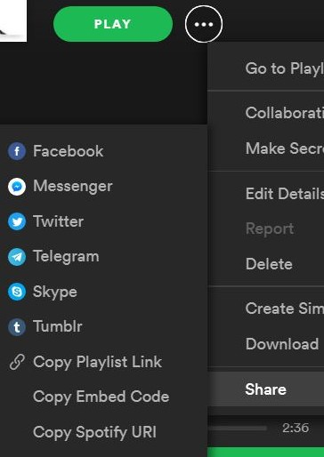

# PlaylistToMP3s
Learn python so i made a playlist downloader

[youtube-dl](https://github.com/ytdl-org/youtube-dl) got pretty much all those feature. this program is basically a wrapper to youtube-dl

Download a playlist (spotify, youtube) by finding  download the mp3 of the music video youtube

## Install

Install all require package
```bash
python3 setup.py install --user
```
Fix bug with youtube search with youtube-dl
```bash
./scripts/youtube-dl.sh
```
Fix bug with youtube-dl download
```bash
sudo apt-get install ffmpeg
```

Change the api key for spotify with your own key [Spotify Developer App](https://developer.spotify.com/dashboard/login) to make it work in `rest/rest.py` and `examples/random_link.py` and `examples/spotify_link.py`
```python
# Spotipy Client ID
SPOTIPYCLIENTID = "SPOTIPY_CLIENT_ID"
SPOTIPYCLIENTSECRET = "SPOTIPY_CLIENT_ID"
```

## How To Use
Work with different music platform like 
- soundcloud, 
- youtube
- spotify(require api key)

### Auto-recognition of link
Download a playlists containing link for the 3 different services

```bash  
python3 random_link.py data/random-list.txt --output random
```

### Youtube

Download a list of link of youtube video
```bash  
python3 youtube_list.py data/youtube-list.txt --output youtube
```
Write the list of link in a youtube playlist
```bash  
python3 youtube_playlist.py "https://www.youtube.com/playlist?list=PLrhzvIcii6GNjpARdnO4ueTUAVR9eMBpc" --output youtube
```

### SoundCloud

Download a list of link of soundcloud
```bash  
python3 soundcloud_list.py data/soundcloud-list.txt --output soundcloud
```

### Spotify

Download a playlist of spotify
```bash  
python3 spotify-playlist.py "https://open.spotify.com/user/spotifycharts/playlist/37i9dQZEVXbMDoHDwVN2tF?si=ZBG2E3XeSbGHEH0vZcYYTQ"  --output "Spotify-Playlist"
```
Download a playlist of spotify with special api key
```bash  
python3 spotify-playlist.py "https://open.spotify.com/user/spotifycharts/playlist/37i9dQZEVXbMDoHDwVN2tF?si=ZBG2E3XeSbGHEH0vZcYYTQ" --output "Spotify-Playlist" --spotipyid CLIENTID --spotipysecret CLIENTSECRET"
```
Get Spotify link for the playlist id and username


## Rest API

### Start server

 ```bash  
python3 rest.py
```

### Test the API with curl
 ```bash  
curl -X POST http://127.0.0.1:5000/api/downloader/random-list.txt
curl -X GET http://127.0.0.1:5000/api/playlist/download_0.zip
```

###  Test the API with web interface
 ```bash  
python3 rest.py
```

open that`\rest\index.html` or http://127.0.0.1:5000/index.html in a browser
- choose file
- read file
- save new file
- chose new file
- Upload file
- Download playlist


### REST API INFO
routing for the web rest API

- Soundcloud:  `/api/soundcloud/<file>` GET
- Youtube:  `/api/youtube/<file>` GET
- Spotify:  `/api/spotify/<link>` or `/api/spotify/<file>` GET
- Downloader:  `/api/downloader/<file>` GET
- Download `/api/playlist/<item>` GET
- View List `/api/view/<item>` GET
- Upload list`/api/upload` POST

